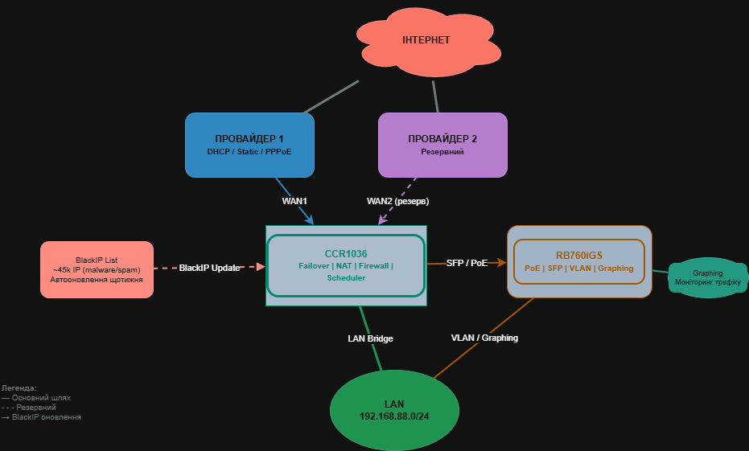

# MikroTik RouterOS — **Безпечний Гайд 2025**  
**Повний посібник з налаштування для підлеглих та адміністраторів**  

[](https://github.com/M1rwana12/mikrotik-setup-guide/commits/main)  
[](https://github.com/M1rwana12/mikrotik-setup-guide/stargazers)  
[](LICENSE)  
[](https://mikrotik.com/download)  
[](README.md)

<div align="center" style="margin: 30px 0;">


**Автор:** [@M1rwana12](https://github.com/M1rwana12)  
**Оновлено:** 10 листопада 2025, 16:03 EET (UA)  
**Пристрої:** CCR1036, RB760iGS, hEX, RB4011 та аналоги  

</div>

---

> **Готовий до розгортання • Безпечний • Зрозумілий**  
> Від підключення до провайдера → до **жорсткого фаєрволу**  
> **Кожна команда + пояснення + кібербезпека**  
> Готово до копіювання у **WinBox → Terminal**

---

## Зміст
- [Wi-Fi — ВИМКНУТИ!](#увага-wi-fi)
- [Початкове Налаштування](#початкове-налаштування)
- [LAN: Міст + IP + DHCP](#lan-мережа)
- [WAN: DHCP / Static / PPPoE](#wan-інтернет)
- [NAT](#nat)
- [Фаєрвол: Повний захист](#фаєрвол)
- [КІБЕРБЕЗПЕКА](#кібербезпека)
- [Топологія мережі](#топологія-мережі)
- [Структура репозиторію](#структура-репозиторію)
- [Як використовувати скрипти](#як-використовувати-скрипти)
- [Додаткові можливості](#додаткові-можливості)
- [Для адміністраторів](#для-адміністраторів)

---

## УВАГА: Wi-Fi — ВИМКНУТИ!

> **Негайно вимкніть Wi-Fi!**  
> За замовчуванням — **відкритий доступ, слабкий пароль, вразливість**.

```bash
/interface wireless disable wlan1
```
> **Пояснення**: Вимикає бездротовий інтерфейс.  
> **Увімкнете пізніше через CAPsMAN (якщо потрібно)**.

---

## Початкове Налаштування

### Підключення
1. **Провайдер → `ether1` (WAN)**  
2. **ПК → `ether2` (LAN)**  
3. Увімкніть роутер

### Доступ через WinBox
1. Завантажте [WinBox](https://mikrotik.com/download)  
2. **Neighbors** → знайдіть за MAC → **Connect**  
3. Логін: `admin` | Пароль: *(порожній)*

```bash
/user set admin password=ТвійСильнийПароль123! full-name="Admin" group=full
```
> **Пояснення**:  
> - 12+ символів (великі, малі, цифри, символи)  
> - `group=full` — повний доступ  
> - `full-name` — для логів

---

## LAN Мережа

```bash
# Міст
/interface bridge add name=bridge-local comment="Локальна мережа (LAN)"

/interface bridge port
add bridge=bridge-local interface=ether2
add bridge=bridge-local interface=ether3
add bridge=bridge-local interface=ether4
add bridge=bridge-local interface=ether5

# IP + DHCP
/ip address add address=192.168.88.1/24 interface=bridge-local
/ip pool add name=lan-pool ranges=192.168.88.2-192.168.88.254

/ip dhcp-server add interface=bridge-local address-pool=lan-pool name=dhcp-lan lease-time=1d
/ip dhcp-server network add address=192.168.88.0/24 gateway=192.168.88.1 dns-server=8.8.8.8,1.1.1.1
```

---

## WAN: Інтернет

```bash
/interface list add name=WAN
/interface list add name=LAN
/interface list member add list=WAN interface=ether1
/interface list member add list=LAN interface=bridge-local
```

### Варіант 1: DHCP (найпоширеніший)
```bash
/ip dhcp-client add interface=ether1 disabled=no add-default-route=yes use-peer-dns=yes
```

### Варіант 2: Статичний IP
```bash
/ip address add address=203.0.113.50/24 interface=ether1
/ip route add dst-address=0.0.0.0/0 gateway=203.0.113.1
/ip dns set servers=8.8.8.8,1.1.1.1 allow-remote-requests=no
```

### Варіант 3: PPPoE
```bash
/interface pppoe-client add interface=ether1 user=ваш_логін password=ваш_пароль \
  add-default-route=yes use-peer-dns=yes disabled=no name=pppoe-out1
```

---

## NAT

```bash
/ip firewall nat add chain=srcnat out-interface-list=WAN action=masquerade comment="LAN → Інтернет"
```
> Для PPPoE: замініть `WAN` на `pppoe-out1`

---

## Фаєрвол: Повний захист

```bash
/ip firewall filter
# === INPUT (захист роутера) ===
add chain=input action=accept connection-state=established,related,untracked comment="Встановлені з'єднання"
add chain=input action=drop connection-state=invalid comment="Відкинути невалідні"
add chain=input action=accept protocol=icmp icmp-options=8:0 limit=1,5 comment="Ping (обмежено)"
add chain=input action=accept in-interface-list=LAN comment="Дозволити з LAN"
add chain=input action=drop in-interface-list=!LAN comment="БЛОК УСЕ З WAN"

# === FORWARD (захист LAN) ===
add chain=forward action=fasttrack-connection connection-state=established,related comment="Прискорення"
add chain=forward action=accept connection-state=established,related,untracked
add chain=forward action=drop connection-state=invalid
add chain=forward action=accept in-interface-list=LAN out-interface-list=WAN comment="LAN → Інтернет"
add chain=forward action=drop in-interface-list=!LAN comment="БЛОК З WAN → LAN"

# Анти-спуфінг
add chain=forward action=drop src-address=192.168.0.0/16 comment="Анти-спуфінг"
add chain=forward action=drop src-address=10.0.0.0/8
add chain=forward action=drop src-address=172.16.0.0/12

# Захист від атак
add chain=forward action=drop protocol=tcp flags=syn connection-limit=50,32 comment="Проти SYN-flood"
add chain=forward action=drop dst-port=0-1023 protocol=tcp in-interface-list=WAN comment="Блок низьких портів"
add chain=forward action=drop protocol=udp dst-port=5060-5061 comment="Блок SIP (якщо не VoIP)"
```

---

## КІБЕРБЕЗПЕКА: Жорсткі правила

```bash
# Вимкнути небезпечні сервіси
/ip service
disable telnet,ftp,www,api,api-ssl
set ssh address=192.168.88.0/24 port=2222
set winbox address=192.168.88.0/24

# Приховати від сканування
/ip neighbor discovery-settings set discover-interface-list=LAN
/tool mac-server set allowed-interface-list=LAN
/tool mac-server mac-winbox set allowed-interface-list=LAN

# DNS — без запитів ззовні
/ip dns set allow-remote-requests=no servers=8.8.8.8,1.1.1.1

# Оновлення (обов’язково!)
/system package update check-for-updates
/system package update install
/system reboot
```

---

## Топологія мережі

<div align="center">



> **Детальна діаграма:**  
> - **CCR1036** — основний роутер (Failover, Firewall, NAT)  
> - **RB760iGS** — допоміжний (SFP, PoE, VLAN)  
> - 2 провайдери (основний + резерв)  
> - Блокування РФ (~45k IP, автооновлення)  
> - Graphing (трафік на графіках)  
> - VLAN 10 (гостьова мережа)  
>  
> **Редагуйте:** [diagrams/topology-failover.drawio](./diagrams/topology-failover.drawio)  
> Відкрийте в [app.diagrams.net](https://app.diagrams.net)

</div>

---

## Структура Репозиторію

```
mikrotik-setup-guide/
│
├── README.md
├── LICENSE
├── scripts/
│   ├── 01-lan.rsc
│   ├── 02-wan-dhcp.rsc
│   ├── 02-wan-static.rsc
│   ├── 02-wan-pppoe.rsc
│   ├── 03-nat.rsc
│   ├── 04-firewall-full.rsc
│   ├── 05-security.rsc
│   ├── 06-failover.rsc          ← 2 провайдери
│   ├── 07-block-ru.rsc          ← Блок РФ
│   └── 08-graphing.rsc          ← Графіки
├── diagrams/
│   ├── topology-failover.drawio
│   └── topology-failover.drawio.png
└── examples/
    └── guest-vlan.rsc           ← Гостьова мережа
```

---

## Як використовувати скрипти

1. Завантажте `.rsc` файл  
2. WinBox → **Files** → перетягніть  
3. Terminal:  
```bash
/import file=01-lan.rsc
```

---

## Додаткові можливості

| Функція | Файл |
|--------|------|
| VLAN для гостьової мережі | `examples/guest-vlan.rsc` |
| **Failover (2 провайдери)** | `scripts/06-failover.rsc` |
| **Блокування РФ** | `scripts/07-block-ru.rsc` |
| **Моніторинг трафіку** | `scripts/08-graphing.rsc` |
| **Обмеження швидкості** | [Див. нижче](#обмеження-швидкості-queue) |

---

## Обмеження швидкості (Queue)

```bash
/queue tree add name="User-Limit" parent=global max-limit=10M/10M
/ip firewall mangle add chain=prerouting src-address=192.168.88.100 action=mark-packet new-packet-mark=user-192.168.88.100
/queue tree add name="192.168.88.100" parent="User-Limit" packet-mark=user-192.168.88.100 max-limit=10M/10M
```

---

## Для адміністраторів

### Авто-бекап на email (щотижня)
```bash
/system scheduler add name=weekly-backup interval=7d on-event="/system backup save name=auto-backup; /tool e-mail send to=admin@company.ua subject=\"MikroTik Backup\" file=auto-backup.backup"
```

### Моніторинг через SNMP
```bash
/snmp set enabled=yes contact=admin@company.ua location="Офіс Київ"
/snmp community set [find name=public] addresses=192.168.88.0/24
```

### Логування атак
```bash
/system logging action add name=syslog remote-address=192.168.88.10 target=remote
/system logging add topics=firewall action=syslog
```

---

<div align="center" style="margin: 50px 0; padding: 25px; background: linear-gradient(135deg, #667eea 0%, #764ba2 100%); border-radius: 20px; color: white; box-shadow: 0 10px 20px rgba(0,0,0,0.2);">

<h2>Твій гайд — №1 в Україні 2025</h2>
<p><strong>Готовий до розгортання на CCR, RB760iGS та будь-якому сучасному MikroTik.</strong></p>

**Зірочка (star) — мотивація для оновлень!**  
**Питання? Пишіть у [Issues](https://github.com/M1rwana12/mikrotik-setup-guide/issues) або Telegram: [@M1rwana12](https://t.me/M1rwana12)**

</div>

---

**© 2025 M1rwana12. Вільне використання з посиланням.**  
**Ліцензія:** [MIT](LICENSE)
```